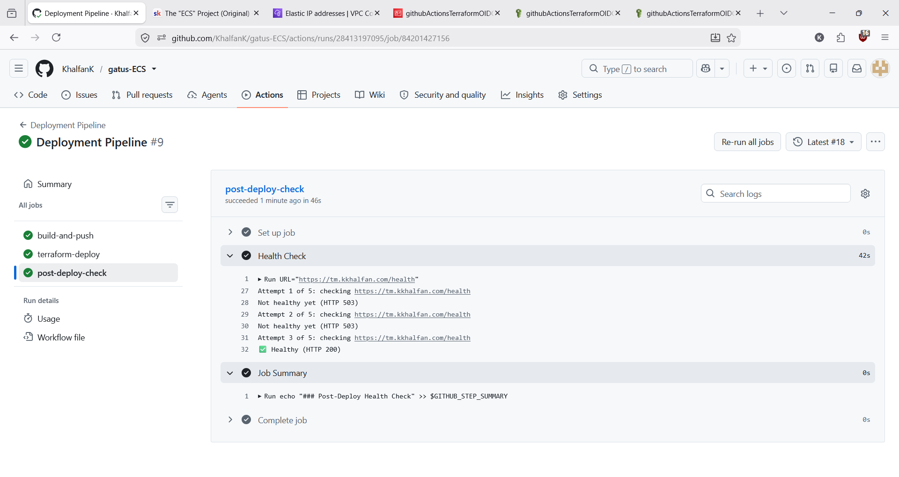
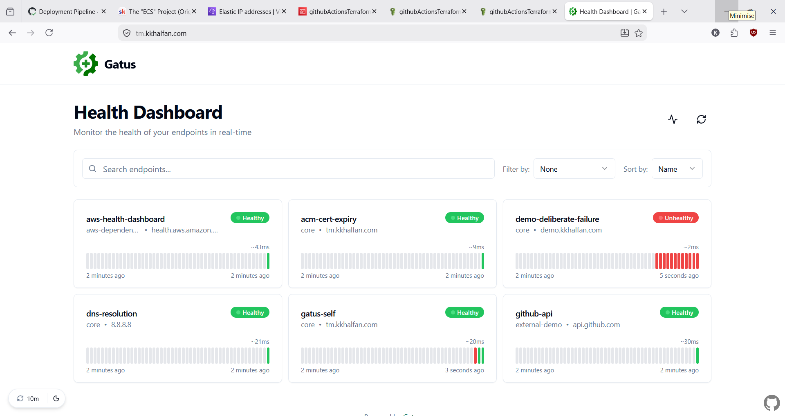

# Gatus on ECS Fargate <!-- omit from toc --> 

(https://github.com/KhalfanK/gatus-ECS/actions/workflows/deploy.yml)


**Production-grade deployment of Gatus on AWS using Terraform, ECS Fargate, Docker and GitHub Actions.**

This project demonstrates modern cloud engineering practices including Infrastructure as Code, secure CI/CD, least-privilege IAM, container orchestration, and automated deployments without using long-lived AWS credentials.

**Live Demo:** https://tm.kkhalfan.com

---

## Contents

- [Deploy Proof](#deploy-proof)
  - [Architecture](#architecture)
  - [Technology Stack](#technology-stack)
  - [Repository Structure](#repository-structure)
  - [Key Architectural Decisions](#key-architectural-decisions)
    - [Persistent and Ephemeral Terraform Stacks](#persistent-and-ephemeral-terraform-stacks)
    - [Infrastructure Discovery via AWS Data Sources](#infrastructure-discovery-via-aws-data-sources)
    - [CI Owns the ECR Repository](#ci-owns-the-ecr-repository)
    - [Separate OIDC Roles for Build and Deployment](#separate-oidc-roles-for-build-and-deployment)
    - [IAM-Based SES Authentication](#iam-based-ses-authentication)
- [Local Development](#local-development)
- [Deployment](#deployment)
- [Requirements](#requirements)
- [Future Improvements](#future-improvements)

---

## Overview

This project deploys Gatus, a lightweight open-source uptime monitoring tool, as a production-grade application on AWS using Terraform, ECS Fargate, Docker, and GitHub Actions.

Key features include:

* **Networking:** Custom VPC spanning two Availability Zones with public and private subnets, a NAT Gateway, and an Internet Gateway.
* **Compute:** Serverless containers running on ECS Fargate.
* **TLS & DNS:** ACM-issued certificates with DNS managed through Cloudflare.
* **Alerting:** Amazon SES email notifications authenticated with IAM roles, eliminating SMTP credentials.
* **CI/CD:** GitHub Actions builds and pushes Docker images to ECR, then deploys infrastructure with Terraform using OIDC authentication and no long-lived AWS credentials.

The infrastructure is split into two Terraform root modules: **persistent** for long-lived resources such as the VPC and ACM certificate, and **ephemeral** for application infrastructure that can be recreated during development without affecting the underlying network.

---

## Deploy Proof

**Successful Deployment**

GitHub Actions builds the Docker image, deploys infrastructure, updates ECS, and performs health check on domain.




<br>

**Running Application**

The live Gatus dashboard served securely over HTTPS from ECS Fargate.


---

## Architecture

---
## Technology Stack

This project showcases experience with:

* Terraform
* AWS ECS Fargate
* Amazon VPC
* Application Load Balancers
* Amazon IAM
* GitHub Actions (CI/CD Pipeline)
* OIDC federation
* Docker
* Amazon ECR
* Amazon SES
* ACM certificates
* Cloudflare DNS
---

## Repository Structure

```text
gatus-ECS/
├── .github/
│   └── workflows/ 
│       └── deploy.yaml
├── app/                        
│   └── ... 
├── config/                     
│   └── config.yaml             
├── infra/                      
│   ├── ephemeral/
│   │   ├── backend.tf
│   │   ├── data.tf
│   │   ├── locals.tf
│   │   ├── main.tf  
│   │   ├── provider.tf
│   │   ├── terraform.tfvars
│   │   ├── variables.tf
│   │   └── modules/
│   │       ├── alb/
│   │       ├── ecs/
│   │       └── natgw/    
│   └── persistent/            
│       ├── backend.tf
│       ├── locals.tf
│       ├── provider.tf
│       ├── terrafrom.tfvars
│       ├── variables.tf
│       └── modules/
│           ├── dns/
│           ├── iam/
│           ├── security/
│           └── vpc/
├── Dockerfile                  
├── README.md
└── .gitignore
```
---

## Key Architectural Decisions

### Persistent and Ephemeral Terraform Stacks

**Decision**

Split the infrastructure into two independent Terraform root modules:

* **Persistent**: VPC, subnets, ACM certificate and other long-lived infrastructure.
* **Ephemeral**: ECS service, ALB, NATGW, EIP and other application infrastructure that changes frequently.

**Why**

* Persistent resources are free or very cheap staying idle.
* Allows rapid iteration without rebuilding the network.
* Prevents unnecessary certificate validation and DNS propagation delays.

**Benefits**

* Faster deployments during development.
* Safer infrastructure changes.
* Optimises for cost.

---

### Infrastructure Discovery via AWS Data Sources

**Decision**

The ephemeral Terraform stack discovers existing infrastructure using AWS `data` sources rather than `terraform_remote_state`.

**Why**

* Keeps the two Terraform stacks loosely coupled.
* Removes the need for access to another state's backend.
* Resources are discovered the same way an operator would locate them.

**Benefits**

* Lower coupling between projects.
* Simpler permissions model.
* Easier future refactoring.

---

### CI Owns the ECR Repository

**Decision**

Amazon ECR is created and managed by the GitHub Actions workflow rather than Terraform.

**Why**

* The infrastructure is regularly destroyed and recreated during development.
* Terraform-managed ECR repositories become awkward to delete once images exist.
* CI can create the repository only when required.

**Benefits**

* Simpler development workflow.
* Avoids `force_delete` and `prevent_destroy` trade-offs.
* Keeps Terraform focused on infrastructure that benefits from state management.

---

### Separate OIDC Roles for Build and Deployment

**Decision**

Use two dedicated IAM roles for GitHub Actions.

* **Build Role**: Limited to ECR operations.
* **Deployment Role**: Used exclusively by Terraform to provision infrastructure.

**Why**

* Different pipeline stages require different permissions.
* A single role would grant attackers many permissions.

**Benefits**

* Better adherence to least-privilege principles.
* Enhanced security.
* Clear separation of responsibilities.

---

### IAM-Based SES Authentication

**Decision**

Authenticate Amazon SES using the ECS Task Role instead of SMTP credentials.

**Why**

* Removes the need to manage usernames and passwords.
* Integrates naturally with AWS IAM.

**Benefits**

* No secrets stored in GitHub or Terraform.
* Easier credential management.
* Improved security posture.

---

# Local Development

Clone the repo and build the image locally to test the Gatus container in isolation:

```bash
git clone https://github.com/KhalfanK/gatus-ECS.git
cd gatus-ECS

docker build -t gatus .
docker run -p 8080:8080 gatus
```

Then visit `http://localhost:8080` to see the Gatus dashboard.

---

# Deployment

The full stack is provisioned via Terraform and deployed via GitHub Actions, manual `terraform apply` isn't really the intended path, but for reference, the persistent stack goes first:

```bash
cd infra/persistent
terraform init
terraform apply

cd ../ephemeral
terraform init
terraform apply -var="ecr_image_tag=<git-sha>"
```

In practice, the `deploy.yaml` workflow can be manually triggered, which builds the image, pushes it to ECR, applies the ephemeral Terraform stack with that build's the Github commit SHA as the image tag, and runs a post-deploy health check against `/health` before marking the run successful.

---

# Requirements

- [Docker](https://docs.docker.com/get-docker/) (20+)
- [Terraform](https://developer.hashicorp.com/terraform/install) (>= 1.15.6)
- [AWS CLI](https://docs.aws.amazon.com/cli/latest/userguide/getting-started-install.html) (>=2.34.41), configured with credentials
- An AWS account with permissions to create VPC/ECS/ALB/ACM/SES/ECR/IAM resources
- A domain managed in Cloudflare (for DNS validation + the live record)
- 
---

# Future Improvements

Potential enhancements include:

* Blue/Green deployments
* Canary deployments
* ECS auto scaling
* CloudWatch dashboards and alarms
* WAF integration
* Cost optimisation using ECS capacity providers
  
---

